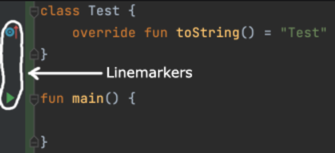
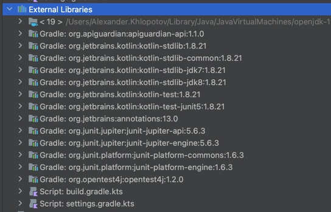

### Preconditions:
We have a template project for ide plugin creation; it will be used for test task implementation. It's recommended to work in the latest stable IDEA.
How to work with the project and properly run written code?
1) run gradle task `runIde`, this task will run intellij idea with preinstalled plugin from this project
2) create a new project from wizard `new project -> kotlin multiplatform -> jvm console application`
3) when the project will be opened, our action will be under `Tools -> Test Task Action 1/2/3`

### Tasks:
1) In the `TestTaskAction1` class, implement the output of the installed kotlin plugin version.
2) In the `TestTaskAction2` class, implement the output of project dependencies (aka External Libraries).
3) In the `TestTaskAction3` class, implement opening the `main.kt` file in the editor and output all line markers from it. Line markers are located in the editor on the left. They invoke some basic actions and other framework and technology-specific features.
4) \* The task with a star. Implement an action that will run the `main.kt` file and check that the task exit code is 0.
5) Write a short checklist/test scenario to check the `jvm console application`. What checks would you add in addition to the previously implemented ones (you don't have to implement them, only list them in the checklist)?

### Useful information:
- see classes `AnActionEvent, ProjectView, PluginManager, FileEditorManager, DaemonCodeAnalyzerImpl, RunContentManager`
- https://plugins.jetbrains.com/docs/intellij/welcome.html

  

-----------------------------------------------------

### 
1) Task 1 is implemented in [ShowKotlinPluginVersionAction.kt](https://github.com/liqlos/test-task-plugin/blob/master/src/main/kotlin/org/jetbrains/ShowKotlinPluginVersionAction.kt), if kotlin plugin is not installed, then this action can not be triggered

2) Task 2 is implemented in [ShowExternalLibrariesAction.kt](https://github.com/liqlos/test-task-plugin/blob/master/src/main/kotlin/org/jetbrains/ShowExternalLibrariesAction.kt), if there is no external libraries, then action can not be triggered neither

3) Task 3 is implemented in [ShowLineMarkersAction.kt](https://github.com/liqlos/test-task-plugin/blob/master/src/main/kotlin/org/jetbrains/ShowLineMarkersAction.kt), data from startOffset, endOffset and lineMarkerTooltip fields of the LineMarkerInfo is used.
   lineMarkerTooltip is formatted because with its full data with html tags in it, it had some problems with displaying in the message element.
   I understand that it is safer to wait for code analysis to complete before printing line markers, I tried an approach with connection.subscribe(DaemonCodeAnalyzer.DAEMON_EVENT_TOPIC (it can be seen in previous commits),
   but couldn't get it to work on time, seems like my code blocks UI thread and analysis stops when action is performed and proceeds after message is closed. 

4) Task 4 is implemented in [RunKotlinFileAction.kt](https://github.com/liqlos/test-task-plugin/blob/master/src/main/kotlin/org/jetbrains/RunKotlinFileAction.kt), this implementation is prone to errors in case file will have compilation problems because result of code analyzing is not taken into account,
   and "Kt" extension is hardcoded to avoid premature optimization because the task was about kt file

   All classes are private because I don't want some external code to depend on them and them to be used outside each action implementation

5) Write a short checklist/test scenario to check the `jvm console application`. What checks would you add in addition to the previously implemented ones (you don't have to implement them, only list them in the checklist)?

Checks which are more related to application itself:
- Check that all the command line arguments for the app are parsed and processed correctly
- Check that console output is readable and correct
- Check that Java and Kotlin code can be run together in a single jvm console application project
- Check that application can be run with different JDKs

Checks which are more related to IDE:
- Check that IDEA will report about possible compilation errors if application has some major issues in its code before running the program
- Check that if there are possible compilation errors than code can not be run via IDE before these issues fixed
- Check that dependencies can be added, updated, removed and used in code without errors

- Check that appropriate highlighting is applied in editor according to file type and the language used
- Check that Kotlin plugin can be enabled, disabled, updated, installed, and deleted without errors
- Check that project opening, code analyzing and dependencies indexing are finishing in appropriate time(no longer than some specific time) on the system with only minimal requirements for IDEA
- Check that IDEA performance is not degrading with kotlin plugin installed
